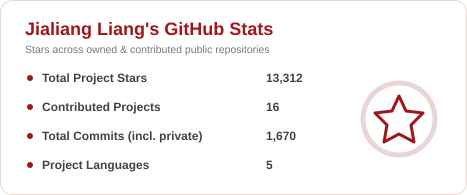
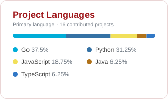

<h1 align="center">Jialiang Liang · lux-liang</h1>

  Open-source systems · LLM infrastructure · Developer tools

  <a href="https://github.com/lux-liang">
    <picture>
      <source media="(prefers-color-scheme: dark)" srcset="./assets/github-stats-dark.svg">
      
    </picture>
  </a>
  <a href="#contributed-projects-selected">
    <picture>
      <source media="(prefers-color-scheme: dark)" srcset="./assets/project-languages-dark.svg">
      
    </picture>
  </a>

## Contributed Projects (Selected)

| Project | Stars | Overview |
| :--- | :---: | :--- |
| [node-csv](https://github.com/adaltas/node-csv) |  | A Node.js toolkit for parsing, generating, and transforming CSV data. |
| [yarr](https://github.com/nkanaev/yarr) |  | A lightweight, self-hosted RSS reader for keeping up with your favorite feeds. |
| [PgQueuer](https://github.com/janbjorge/pgqueuer) |  | A PostgreSQL-backed task queue for Python background jobs. |
| [Floci GCP](https://github.com/floci-io/floci-gcp) |  | A lightweight local GCP emulator for cloud development and testing. |
| [Network Doctor](https://github.com/heymaikol/network-doctor) |  | A cross-platform terminal toolkit for diagnosing connectivity, proxy, and protocol issues. |
| [MCPProxy](https://github.com/smart-mcp-proxy/mcpproxy-go) |  | An MCP proxy that centralizes tool discovery and access for AI agents. |
| [runs-on.dev](https://github.com/zordhalo/runs-on.dev) |  | Free runs-on.dev subdomains for developer projects. |
| [TrenTorch](https://github.com/TrenTorch/TrenTorch) |  | Machine learning, deep learning, and model inference from first principles. |

## Research Projects

| Project | Role | Overview |
| :--- | :---: | :--- |
| [SWE-Pruner Pro](https://github.com/Ayanami1314/swe-pruner-pro) | **Core Contributor** | Uses coding models’ internal representations to prune context and reduce token costs in long-horizon agent tasks. [Paper](https://arxiv.org/abs/2607.18213) |
| [SWE-Explore Benchmark](https://github.com/Qiushao-E/SWE-Explore-Bench) | **Co-first Author** | Benchmarks repository exploration, code localization, and context ranking using real coding-agent trajectories. [Paper](https://arxiv.org/abs/2606.07297) |
